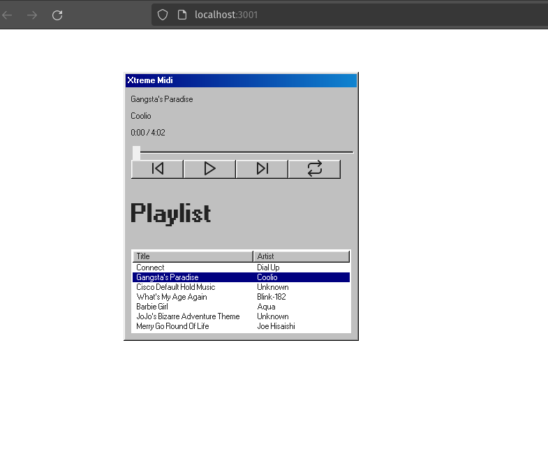

This is a [Next.js](https://nextjs.org) project bootstrapped with [`create-next-app`](https://nextjs.org/docs/app/api-reference/cli/create-next-app).

## Getting Started

First, run the development server:

```bash
npm run dev
# or
yarn dev
# or
pnpm dev
# or
bun dev
```

Open [http://localhost:3000](http://localhost:3000) with your browser to see the result.



The window is draggable and midi files playable. Wow neat!

```tsx
import { RetroMusicPlayer } from "./MusicPlayer";

export default function Home() {
  return (
    <div style={{height: '100vh', width: '100vw'}}>
      <RetroMusicPlayer />
    </div>
  );
}
```


Inspired by:

- https://github.com/surikov/webaudiofont/ 
- https://jdan.github.io/98.css/#tree-view